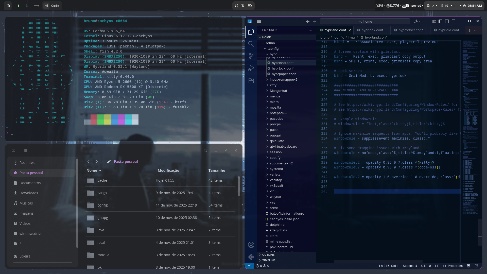

# Dotfiles Setup Guide


This repository contains configuration files for Hyprland and related tools.

## Requirements

Make sure the following packages and tools are installed:

```bash
sudo pacman -S hyprland
sudo pacman -S hypridle
sudo pacman -S hyprlock
sudo pacman -S hyprpaper
sudo pacman -S waybar
sudo pacman -S grimblast-git
sudo pacman -S fastfetch
```

Walker and Elephant tools:

```bash
yay -S walker-bin elephant elephant-providerlist elephant-desktopapplications
```

SDDM Astronaut Theme:

```bash
sh -c "$(curl -fsSL https://raw.githubusercontent.com/keyitdev/sddm-astronaut-theme/master/setup.sh)"
```

## Installation

1. Clone this repository into your home directory or preferred location.  
2. Copy the configuration files to their respective locations (e.g., `~/.config/hyprland/`, `~/.config/waybar/`, etc.).  
3. Install all required packages listed above.  
4. Configure the SDDM Astronaut Theme as per the setup script.  

## Notes

- Use `Hyprpaper` to set wallpapers for your monitors.  
- The Walker and Elephant tools provide additional menu and desktop application management.  
- Grimblast is used for screenshots, and Fastfetch displays system info on launch.  
- After installing the SDDM Astronaut Theme, choose the **'black hole'** template and update the `black_hole.conf` as needed.

---

## Running Steam Games on an NTFS Partition
If you want to store Steam games on an NTFS partition in Linux, follow these steps carefully. NTFS is not fully Linux-native, so extra precautions are needed to avoid game launch issues.

Requirements: make sure to have ```ntfs-3g``` installed:

```bash
sudo pacman -S ntfs-3g
```

1. Edit `/etc/fstab` to mount the NTFS partition with proper permissions. Open the file:
   
```bash
sudo nano /etc/fstab
```

Add this line (replace the UUID with your drive’s UUID):

```bash
UUID=266EA8206EA7E731  /E  ntfs-3g  uid=1000,gid=1000,rw,user,exec,umask=000 0 0
```

Then mount it:

```bash
sudo mount -a
```

2. Set ownership for your user (replace bruno with your username):

```bash
sudo chown -R bruno:bruno /E
```

3. Move the Proton compatibility data to a Linux-native filesystem (to handle symlinks and permissions properly):

```bash
mkdir -p /home/bruno/SteamCompatData
mv /E/SteamLibrary/steamapps/compatdata /home/bruno/SteamCompatData/
ln -s /home/bruno/SteamCompatData /E/SteamLibrary/steamapps/compatdata
```

4. Run Steam normally. Your games will now launch from the NTFS partition, while Proton stores compatibility data safely on your Linux filesystem.

⚠️ Note: NTFS is not fully supported for Linux game libraries. Some games may still encounter issues. For best stability, use a Linux-native filesystem (ext4, btrfs) if possible.

---

**PS:** Don’t forget to keep your system updated:

```bash
sudo pacman -Syu
```
